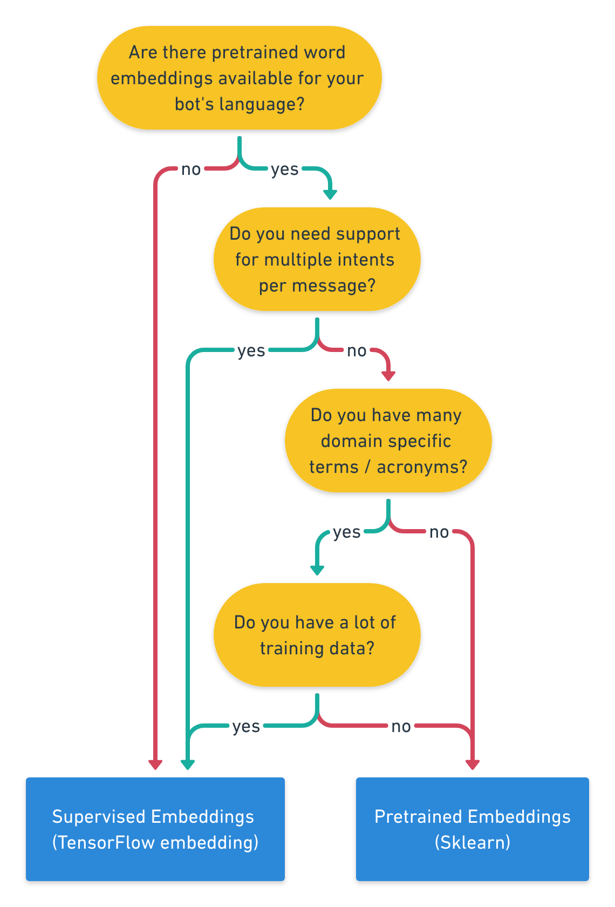

# Rasa-ChatBot

Chatbot powered by Rasa. Demonstrating strong NLP and NLU capabilities.

AI assistants have to fulfill two tasks: understanding the user and giving the correct responses. 

- Rasa stack tackles these tasks with the natural language understanding component Rasa NLU and the dailouge management component Rasa Core. 

1) Intent Recognition - How to better undersand your users

- Rasa NLU provides full customizability by processing user messages in so called - "pipiline".

- A pipeline defines different components which proces a user message sequentially and ultimately lead to the classification of user messages into intents and the extraction of entities. 

## Intents : What does the User Say

Rasa uses the concept of intents to describe how user messages should be categorized. Rasa NLU will classify the user messages into one or also multiple user intents. The two components between which we can choose are :

- Pretrained Embeddings (Intent_classifier_sklearn)
- Supervised Embeddings (Intent_classifier_tensorflow_embedding) 

`restraunt_search` can be expressed in many different ways:
- I'm hungry
- Show me good pizza spots
- I want to take my boyfriend out for sushi


### Pretrained Embeddings : Intent Classifier Sklearn

- This classifier uses the spaCy library to load pretrained language models which then are used to represent each word in the user message as word embedding.
- Word embeddings are vector representation of words, meaning each word is converted to dense numeric vector.
- Word embeddings capture semantic and syntactics aspects of words. This means that similar words should be represented by similar vectors. 
- Rasa NLU takes the average of all word embeddings within a message, and then performs a gridsearch to find the best parameters for the support vector classifier which classifies the averaged embeddings into the different intents. The gridsearch trains multiple support vector classifiers with different parameter configurations and then selects the best configuration based on the test results.

#### When should we use this Pretrained Embeddings

- When we use pretrained word embeddings, we can benefit from the recent research advances in training more powerful and meaningful word embeddings. 
- Since the embeddings are already trained, the SVM requires only little training to make confident intent predictions. 
- Even if we have only small amount of training data, we will get robust classification results. 
- Unfortunately good word embeddings are not available for all languages since they are mostly trained on public available datasets which are mostly English. 
- Also they do not cover domain specific words, like product names or acronyms. In this case it would be better to train our own word embeddings with the supervised embeddings classifier.

## Supervised Embeddings: Intent Classifier Tensorflow Embedding

- The intent classifier intent_classifier_tensorflow_embedding was developed by Rasa and is inspired by Facebook's starspace paper.
- Instead of using pretrained embeddings and training a classifer on top of that, it trains word embeddings from scratch.
- It is typically used with the intent_featurizer_count_vectors component which counts how often distinct words of your training data appear in a message and provides that as input for the intent classifier.
- Furthermore, another count vector is created for the intent label.
- In contrast to the classifier with pretrained word embeddings the tensorflow embedding classifier also supports messages with multiple intents(e.g if user says "Hi, how is the weather? the message could have the intents greet and ask_weather) which means the count vector is not one-hot encoded.
- The classifier learns separate embeddings for feature and intent vectors.
- Both embeddings have the same dimensions, which make it possible to measure the vector distance between the embedded features and the embedded intent labels using cosine similarity. 
- During the training the cosine similarity between the user messages and associated intent labels is maximized.

#### When should we use Supervised Embeddings:

- As this classifier trains word embeddings from scratch, it needs more training data than the classifier which uses pretrained embeddings to generalize well.
- However, as it is trained on your training data, it adapts to your domain specific messages as there are e.g no missing word embeddings
- Below flow chart explains which is the best component to use for your contextual AI assistant.

<p align="center">
  
</p>


## Common problems

#### Lack of training data

- When the bot is actually used by users we will have plenty of conversational data to pick our training examples from.However, specially in the beginning it is a common problem that you have little to none training data and the accuracies of  intent classification are low.
- A often used approach to overcome this issue is to use the data generation tool chatito.
- Generating sentences out of predefined word blocks can give you a large dataset quickly.Avoid using data generation tool too much, as the model may overfit on generated sentenced structures.
- It's strongly recommended to use data from real users.

#### Out-of-Vocabulary Words

- English is a popular language with many millons of words. Users will use words which your trained model has no word embeddings for, e.g by making typos or less frequent words.
- In case we are using pretrained word embeddings there is not much we can do except trying langauge models which were trained on larger corpus.
- In case we are training the embeddings from scratch using the intent_classifier_tensorflow_embedding classifier, we have two options : either include more training data or add examples which include the OOV_token (out-of-vocabulary token). 

#### Similar Intents

- When intents are very similar, it is harder to distinguish them. What sounds obvious, often is forgotten when creating intents.
- Imagine the case, where a user provides their name or gives you a date. Intutively we might create an intent `provide_name` for the message `It is Sara` and an intent `provide_date` for the message `It is Monday`. 
- However, from an NLU perspective these messages are very similar except for their entities. 
- For this reason it would be better to create an intent `inform` which unifies `provide_name` and `provide_date`.

#### Skewed data

- We should always aim to maintain a rough balance of the number of examples per intent. However, sometimes intents(e.g the inform intent from the example above) can outgrow the training examples of other intents.
- While in general more data helps to acheive better accuracies negatively. 
- Hyperparameter optimization can help to cushion the negative effects, but the best solution is to reestablish the balanced dataset.

## Entity Extraction

- Pieces of information which helps a chatbot understand what specifically a user is asking about by recognising the structured data in the sentence.
- Understanding the user's intent is only part of the problem. It is equally important to extract relevant information froma user's message, such as dates and addresses. This process of extracting the different required pieces of information is called entity recognition.

- Entity recognition with Spacy language models: ner_spacy
- Rule based entity recognition using Facebook's Duckling: ner_http_duckling
- Training an extractor for custom entities: ner_crf

`Book a table for June 10th at a sushi restraunt in New York City`

In a restraunt search example, extracting entities out of the above sentence include extracting `June 10th` as `date` , `sushi` as `restraunt` and `New York city` as a `location`.

##### Beyond keywords : Context
- Keywords don't work for entities we haven't seen before
Use contextual clues:
- Spelling
- Capitalization
- Words occuring before & after

- Pattern recognition

#### SpaCy

The spaCy library offers pretrained entity extractors. As with the word embeddings, only certain languages are supported. If our language is supported, the component `ner_spacy` is the recommended option to recognise entities like organization names, people's names, or places.

#### Duckling

Duckling is the rule-based entity extraction library developed by Facebook. If we want to extract any number of related information e.g amounts of money, dates, distances or durations.

#### NER_CRF

- Neither `ner_spacy` nor `ner_duckling` require you to annotate any of the training data. since they are either using pretrained classifiers(spacy) or rule-based approaches(Duckling).
- The `ner_crf` component trains a `conditional random field` which is then used to tag entities in the user messages. 
- Since this component is trained from scratch as part of the NLU pipeline, we have to annotate our training data ourself.
- Provide enough examples (>20) per emtity so that the CRF can generalize and pick up the data
- Annotate the training examples everywhere in the training data(even if the entity might not be relevant for the intent)

#### Regular Expressions / Lookup Tables

- To support the entity extraction of the `ner_crf` component, we can also use regular expressions or lookup tables.
- Regular expressions match certain hard coded patterns, e.g[0-9]{5} would match 5 digit zip codes. 
- Lookup tables are useful when your entity has a predefined set of values. The entity country can for example only have 195 different values.
- To use regular expressions and/or lookup tables add the `intent_entity_featurizer_regex_component` before the `ner_crf` component in the pipeline. Then annotate the training data.

### Rasa data format

- We provide training data in JSON file. Contains list of dictionaries called training examples

```python
from rasa_nlu.converters import load_data
training_data = load_data("./training_data.json")
```

- training_data object contains a list of dictionaries called training examples
- Each of these dictionaries contains example message, its intent and the list of entities found in the message
- We can convert one of the dictonaries to readable JSON using `json.dumps(data.training_examples[22], indent = 2))`
- indent = 2, specifies the number of spaces to indent

### Interpreter
- The way to use RASA NLU in python code is to run interpreter object.
- This contains the trained model for intents and entities
- To use it pass a message to interpreter's `parse` function. `interpreter.parse(message)`
- This returns a dictionary with the extracted intents and entities

#### How to create an Interpreter
- To train our model we create a configuration and a trainer
- Creating a model:
```python
from rasa_nlu.config import RasaNLUConfig
from rasa_nlu.model imort Trainer
config = RasaNLUConfig(cmdline_args={"pipeline":"spacy_sklearn"})
trainer = Trainer(config)
interpreter = trainer.train(training_data)
```
- Here we used `spacy_sklearn` pipeline

### Rasa pipelines

- Rasa pipeline is the list of components used to process text
- **nlp_spacy** --> initializes the spacy English model
- **ner_crf** --> uses the conditional random field model to extract entities
- **ner_synonyms** --> maps entities with the same meanings to the same key. eg. If we want to treat NYC and New York city as synonyms
- **intent_featurizer_spacy** --> creates vector representation of sentences
- **intent_classifier_sklearn** --> sklearn Support Vector Classifier

- When the model is trained and used with this pipeline, these steps are performed automatically
- Inorder to train a custom entity recognizer for our domain the recommended component is **`ner_crf`** 

#### Conditional random fields
- Machine learning model, popular for named entity recognition
- Can perform well even with small training data

#### Handling typos
- One downside of word vectors is that if important words are misspelled then it's very hard for the classifier to correctly predict intents. 
- And for many words there isn't any word vectors because they didnt appear in training corpus.
- **RASA NLU can remedy this if we include `intent_featurizer_ngrams` component**
- **This component looks at all the words in the training data for which there are'nt word vectors including miss spelled words, then it looks for sub words units  or character ngrams which are predective of the intent**
- e.g if the word dollars is an important indicator of a price request, this component will pick up the sequence **`dolla`** as an important one.
- We need to ensure that our training data contains this out-of-vocabulary words or miss spellings or else model won't be able to learn from them.


## Virtual assistants

- Common chatbot use cases include:
1) Scheduling a meeting
2) Booking a flight
3) Searching a restraunt

- Require information from outside world.
- Need to interact with databases or APIs

### ** Basic SQl **

select * from restaurants;
select name, rating from restaurnats;
select name from restaurants where area = 'center' and pricerange = 'hi';

- Python has a module called SQlite which let's us interact with SQl database

```python
import sqlite3
conn = sqlite3.connect('hotels.db') # establish connection with database
c = conn.cursor()                   # to execute queries
c.execute("select * from hotels where area='south' and pricerange='hi'")
c.fetchall()
```

### SQl injection
#### bad idea
```python
query = "select name from restaurant where area='{}'".format(area)
c.execute(query)
```
#### better
```python
t = (area, price)
c.execute('select * from hotels where area=? and price=?', t)
```

### Exploring a DB with natural language

- We want to generate queries that corresponds to the following kinds of messages

** example messages**
- Show me a great hotel
- "i'm looking for a cheap hotel in the south of town"
- "anywhere so long as it's central"

- We dont know beforehand what criterias user will ask. So this adds a little more complexity while writing queries

#### Parameters from text
- let's extract query parameters from the query
- We have an interprepter object which has an already trained RASA NlU model loaded.
- We pass the message to `interpreter.parse(message)` to get the intents and entities.


## Incremental slot filling and negation
- First part is to add some memory to the bot so that the users can narrow down their search incrementally

- The process of collecting the user's preferences during the conversation is called **slot filling**

#### Basic memory

- To add a basic version of the memory we can add parameters in a dictionary

```python
def respond(message, params):
	# update params with entities in message
	# run query
	# pick response
	return response, params

# initialise params
params = {}

#message comes in
response, params = respond(message, params)
```

- If the user has said he is looking for cheap hotels, we need to save price range=lo in the params dictionary
- Tricky thing is to decide when to wipe the memory off and let the user start over

## Negation

- A simple approach that will work for most obvious cases bot is likely to see(not a general approach)
- Split the sentences into phrases and see which entities has a word **no** infront of them
e.g no I do**`n't`** want Sushi
**`not`** sushi, maybe pizza?
I want burritos **`not`** sushi

- Assume that "not" or "n't" just before an entity means user wants to exclude this
- But would fail in cases like "I would rather skip the dinner then eating at sushi" or "I hate sushi" etc

## Stateful Bots

- Means bots have a memory.A additional piece of memory, a state-machine. A simple e.g is traffic light. When a event is received by traffic light, it changes its state red-to-green or green-to-yellow
- Shopping is a typical use case where state-machine can simply the implementation of the bot.A user begins by browsing, once they select items we need to collect information from them like card details or shipping address.
- To implement the state machines, we need some symbols to define the state and its commn to use integers for this purpose.

#### Implementing a state machine (to order coffee)
- Let's define 3 states :
```python
INIT = 0
CHOOSE_COFFEE = 1
ORDERED = 2
```

- Then we need to define some rules or events which switches between these states
- e.g if we are in `INIT` state and user wants to order cofee then we need to push bot to `CHOOSE_COFFEE` state.

- Once user confirms which coffee he wants to buy, with the specified coffee intent we place an order for them and move them in the `ORDERED_STATE`

- We can define these rules in a dictionary, **for each key is a tuple of the current state and the expressed intent** and **each value is also a tuple of the next state and the message to the user** 

```python
policy_rules = {
    (INIT, "order"): (CHOOSE_COFFEE, "ok, Columbian or Kenyan?"),
    (CHOOSE_COFFEE, "specify_coffee"): 
    (ORDERED, "perfect, the beans are on their way!"),
}
```

#### Using the state machine
- To use this state machine in our bot, we need to think of the scope of the state varaible. It should be outside the `respond` and `send_message` functions 
- We define a interpret function which returns the intent for any given message.
- `send_message` function returns a `new_state` value 
- update the `state` with `send_message` output.


## Acknowelgement 

1) https://blog.rasa.com/rasa-nlu-in-depth-part-2-entity-recognition/
2) https://blog.rasa.com/rasa-nlu-in-depth-part-1-intent-classification/


